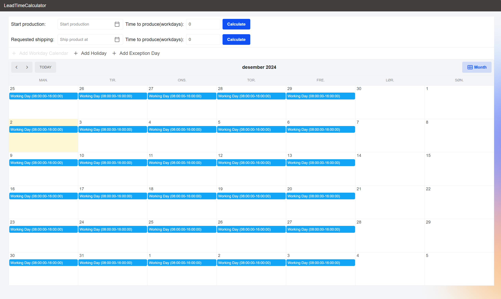

# Lead-Time Calculator

## How to Run the Project

To run this project, you will need the following prerequisites:

1. **Visual Studio 2022** (Community, Professional, or Enterprise):

   - You can download it from [here](https://visualstudio.microsoft.com/downloads/).

2. **.NET 9 SDK**:

   - This project is built on .NET 9, so you will need to install the SDK from [Microsoft's official website](https://dotnet.microsoft.com/en-us/download/dotnet/9.0).

3. **Aspire**:
   - Instead of using Docker Compose, I've chosen **Aspire**, as it’s native to .NET. To install Aspire, the easiest way is through the Visual Studio Installer. Detailed instructions are available on [Microsoft's documentation](https://learn.microsoft.com/en-us/dotnet/aspire/fundamentals/setup-tooling?tabs=windows&pivots=visual-studio).

Once you have the necessary tools installed:

- Clone this repository or download it as a ZIP file.
- Open the solution file in Visual Studio.
- Set **"LeadTimeCalculator.Orchestrator"** as the startup project by right-clicking the project in the Solution Explorer and selecting **Set as StartUp Project**.
- Finally, click the green **Run** button or press **F5** to launch the application.

## Project Structure

The project is organized into features, with the **WorkdayCalendarFeature** as the core domain and functionality. All business logic is encapsulated in the **LeadTimeCalculator.API** HTTP API.

## Approach to Solving the Exercises

I prefer and advocate for **Test-Driven Development (TDD)**, as it ensures that the code remains clean, testable, and well-structured.

For this exercise, I applied some **Domain-Driven Design (DDD)**, beginning by analyzing the terminology used (which should in a bigger process resulted in a UL) in the interview document and create the models needed for the required functionality.
Initially, I was not concerned with how the data should be stored, as the problem doesn't dictate a specific persistence strategy.

My approach began by creating a test for the first example, **BasicWorkingDayCalculationTest**. This test served as the foundation for determining the necessary classes and logic to make the test pass.

## TODO

There are several areas for improvement that I would address in future iterations of this project:

✔: Done, could also be partially and i have not bothered going to the full extend.

✖: Not started or won't do.

- ✔ **Logging/Metrics**: Could be improved.
- ✖ **Proper Persistence**: While optional, this could be improved.
- ✔ **Continuous Integration**: This should have been configured from the start.
- ✖ **Continuous Delivery with IaC**: This should also be configured from the beginning.
- ✖ **Branching Strategy**: Currently, everything is pushed to the `main` branch.
- ✖ **Security/Quality Code Scanning**: Tools like **Snyk** and/or **SonarCloud** should be integrated for scanning and monitoring security and quality.
- ✖ **Frontend Tests**: There are no tests for the frontend at the moment.
- ✖ API -> Application: Mediatr Could have been used to dispatch requests to the application layer, to avoid having to reference handlers directly in the API-project.

## General Notes

- The frontend could use some additional work, but given the short timeframe and my busy schedule, I did my best to implement a functional solution within the constraints.
- I have not used AI for anything other than polishing this README file or helped with commenting code for better formulations. The code itself is written solely by me, **Sebastian Nordby**.

Check out the YouTube video for how to use the software: https://www.youtube.com/watch?v=9zVJeKKJZnA
